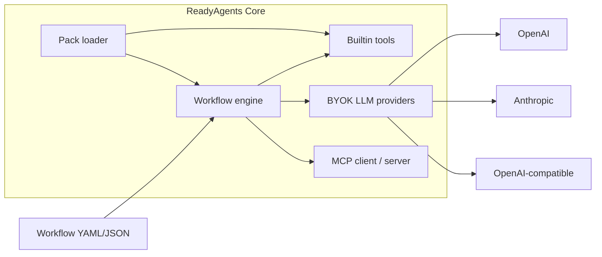

# ReadyAgents Core

Open-source **Agent Workflow engine + MCP Toolkit**. Bring your own API keys (BYOK).

Tried it? Open an [I-ran-this](https://github.com/readyagents/readyagents-core/issues/new?template=i-ran-this.md) issue.
We are not launching. We are listening.

This is the free core of [ReadyAgents](https://github.com/readyagents). Commercial **packs** (always-on / continuous systems, hosted control plane) sit on top of this engine. They are not required to run workflows.

Package `readyagents` **0.2.0**. Not on PyPI — install from this repo.

## What it does

- Define agent workflows as YAML or JSON (nodes + edges)
- Run **agent**, **tool**, **condition**, **transform**, **approval**, **parallel**, and **include** nodes
- Persist after every node and **resume** a paused or failed run from the last successful node
- Inspect past runs: `readyagents runs list` / `show` / `replay` / `report` (local HTML)
- Scaffold a starter: `readyagents new my-flow` (`basic`, `approval`, `research`, `pipeline`, `review`)
- Builtin tools with **zero extra servers**: `now`, `calc`, `json_get`, `read_file`, `write_file`, optional `http_get`
- Optional [MCP](https://modelcontextprotocol.io) client and server (`readyagents mcp serve`)
- Extra node types and tools via Python entry points (`readyagents.packs`)

## 60-second start

Requires Python 3.11+.

```bash
git clone https://github.com/readyagents/readyagents-core.git
cd readyagents-core
python -m venv .venv
source .venv/bin/activate   # Windows: .venv\Scripts\activate
pip install -e .
```

This package is **not on PyPI**. Install only from the clone above.

Smoke test — **no API keys**:

```bash
readyagents run examples/calc_pipeline.yaml
readyagents runs list
readyagents runs report <run_id>

readyagents new my-flow
readyagents run examples/approval_gate.yaml --approve gate
readyagents run examples/composed_gate.yaml --approve gate
```

Human-in-the-loop without a decision **pauses** (exit 2, does not hang) and can be resumed:

```bash
readyagents run examples/approval_gate.yaml
readyagents runs list
readyagents resume <run_id> --approve gate
# or
readyagents resume <run_id> --reject gate
```

With a key in `.env` (`OPENAI_API_KEY` or `ANTHROPIC_API_KEY`):

```bash
readyagents run examples/research_brief.yaml --input topic="agent workflows"
```

## Architecture



## CLI

| Command | Purpose |
| --- | --- |
| `readyagents init` | Write `.env` from `.env.example` if missing |
| `readyagents new [name] [--template basic\|approval\|research\|pipeline\|review]` | Scaffold workflow + README + `.env.example` |
| `readyagents validate PATH` | Schema-validate a workflow |
| `readyagents run PATH [--input KEY=VALUE] [--dry-run] [--approve NODE] [--reject NODE]` | Execute |
| `readyagents resume RUN_ID [--approve NODE] [--reject NODE]` | Resume a paused or failed run |
| `readyagents runs list` | List persisted runs |
| `readyagents runs show RUN_ID` | Node timeline + stored state (`inspect` is an alias) |
| `readyagents runs report RUN_ID` | Local HTML summary of a run |
| `readyagents runs replay RUN_ID` | New run from stored inputs |
| `readyagents mcp serve` | Stdio MCP server (builtin tools) |
| `readyagents packs` | List installed packs |
| `readyagents version` | Print version |

## Examples (no keys unless noted)

| File | What it shows |
| --- | --- |
| `examples/calc_pipeline.yaml` | Builtin tools, transform, condition |
| `examples/approval_gate.yaml` | Human-in-the-loop pause / resume |
| `examples/fanout_gate.yaml` | Parallel branches + approval |
| `examples/include_demo.yaml` | Sub-workflow `include` |
| `examples/composed_gate.yaml` | Include + parallel + approval |
| `examples/research_brief.yaml` | Agent node (needs a key) |
| `examples/support_triage.yaml` | Classify then branch (needs a key) |
| `examples/code_review.yaml` | `read_file` + review (needs a key) |

## Docs

- [Getting started](docs/getting-started.md)
- [First ten minutes](docs/first-ten-minutes.md)
- [Concepts](docs/concepts.md)
- [Configuration (BYOK)](docs/configuration.md)
- [Workflows](docs/workflows.md)
- [MCP](docs/mcp.md)
- [Packs](docs/packs.md)
- [CLI](docs/cli.md)
- [Changelog](CHANGELOG.md)
- [Release notes 0.2.0](RELEASE_NOTES.md)

## Install extras (still from this checkout)

LLM and MCP extras are optional. Install them from the cloned repo, not from PyPI:

```bash
pip install -e ".[openai]"
pip install -e ".[anthropic]"
pip install -e ".[mcp]"
pip install -e ".[all]"
```

Then `cp .env.example .env` and paste your own keys. Core workflows that only use builtin tools do **not** need extras, keys, or Node.js.


## What is not in core

These belong in **Premium Packs**, not this repository:

- Always-on / continuous workers and schedulers
- Hosted control plane, teams, SSO
- Distributed recovery and remote run stores
- Alerting, paging, billing

## License

Apache License 2.0. See [LICENSE](LICENSE).

## Security

Please report vulnerabilities as described in [SECURITY.md](SECURITY.md). Do not commit API keys. Local operator files such as `.env` are gitignored.
