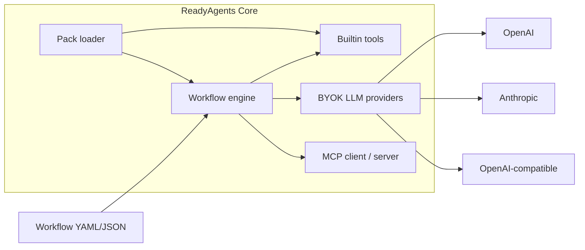

# ReadyAgents Core

Open-source **Agent Workflow engine + MCP Toolkit**. Bring your own API keys (BYOK).

This is the free core of [ReadyAgents](https://github.com/readyagents). Commercial **packs** (for example always-on / continuous systems) sit on top of this engine — they are not required to run workflows.

## What it does

- Define agent workflows as YAML or JSON (nodes + edges)
- Run **agent** (LLM), **tool**, **condition**, and **transform** nodes
- Built-in tools that work with **zero extra servers**: `now`, `calc`, `json_get`, `read_file`, `write_file`, optional `http_get`
- Optional [MCP](https://modelcontextprotocol.io) client (call other MCP servers) and server (`readyagents mcp serve`)
- Discover extra node types and tools via Python entry points (`readyagents.packs`)

## 60-second start

Requires Python 3.11+.

```bash
git clone https://github.com/readyagents/readyagents-core.git
cd readyagents-core
python -m venv .venv
source .venv/bin/activate   # Windows: .venv\Scripts\activate
pip install -e ".[all]"
cp .env.example .env        # then paste your keys if you want LLM examples
```

Smoke test — **no API keys**:

```bash
readyagents run examples/calc_pipeline.yaml
```

With a key in `.env` (`OPENAI_API_KEY` or `ANTHROPIC_API_KEY`):

```bash
readyagents run examples/research_brief.yaml --input topic="agent workflows"
```

## Architecture



## CLI

| Command | Purpose |
| --- | --- |
| `readyagents init` | Write `.env` from `.env.example` if missing |
| `readyagents validate PATH` | Schema-validate a workflow |
| `readyagents run PATH [--input KEY=VALUE] [--dry-run]` | Execute |
| `readyagents mcp serve` | Stdio MCP server (builtin tools) |
| `readyagents packs` | List installed packs |
| `readyagents version` | Print version |

## Docs

- [Getting started](docs/getting-started.md)
- [Concepts](docs/concepts.md)
- [Configuration (BYOK)](docs/configuration.md)
- [Workflows](docs/workflows.md)
- [MCP](docs/mcp.md)
- [Packs](docs/packs.md)
- [CLI](docs/cli.md)

## Install extras

```bash
pip install "readyagents[openai]"
pip install "readyagents[anthropic]"
pip install "readyagents[mcp]"
pip install "readyagents[all]"
```

Core workflows that only use builtin tools do **not** need extras or Node.js.

## License

Apache License 2.0. See [LICENSE](LICENSE).

## Security

Please report vulnerabilities as described in [SECURITY.md](SECURITY.md). Do not commit API keys. Local operator files such as `.env` are gitignored.
